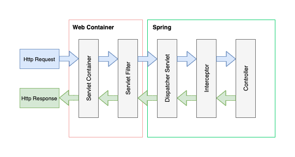

### Servlet 과 Spring



Spring 에서 http request의 흐름은 위와 같은 형태로 진행됩니다. Container에서 http request가 들어오면 각각의 단계 별로 메서드를 호출합니다. 

### Servlet container
Servlet container 는 Servlet 을 실행 및 관리하는 주체 입니다. 스펙이 정해져있으며 tomcat, jeus 등이 있습니다.

### Servlet 
servlet은 `javax.servlet` 패키지에 정의된 인터페이스 입니다. 자바 플랫폼에서 컴포넌트를 기반으로 하는 웹 애플리케이션을 개발할 때 사용하는 기술입니다. 3개의 life cycle을 갖습니다.
- init: 초기화 단계에서 실행. 클래스 단위에서 단 한번만 실행

- service: 스레드로 사용자 요청을 처리

- destroy: 상태 종료시 호출

### Dispatcher Servlet
spring에서 모든 요청은 dispatcher servlet을 통해 작성된 controller로 요청을 넘깁니다. 즉, 최상단의 controller라고 정의할 수 있으며, Spring ioc 컨테이너안에 있어 Spring의 모든 기능을 사용할 수 있습니다. dispatcher servlet은 `web.xml` 또는 `WebApplicationInitializer` 으로 servlet context에 등록합니다.

```xml
<web-app>

    <listener>
        <listener-class>org.springframework.web.context.ContextLoaderListener</listener-class>
    </listener>

    <context-param>
        <param-name>contextConfigLocation</param-name>
        <param-value>/WEB-INF/app-context.xml</param-value>
    </context-param>

    <servlet>
        <servlet-name>app</servlet-name>
        <servlet-class>org.springframework.web.servlet.DispatcherServlet</servlet-class>
        <init-param>
            <param-name>contextConfigLocation</param-name>
            <param-value></param-value>
        </init-param>
        <load-on-startup>1</load-on-startup>
    </servlet>

    <servlet-mapping>
        <servlet-name>app</servlet-name>
        <url-pattern>/app/*</url-pattern>
    </servlet-mapping>

</web-app>
```

```java
public class MyWebApplicationInitializer implements WebApplicationInitializer {

    @Override
    public void onStartup(ServletContext servletContext) {

        // Load Spring web application configuration
        AnnotationConfigWebApplicationContext context = new AnnotationConfigWebApplicationContext();
        context.register(AppConfig.class);

        // Create and register the DispatcherServlet
        DispatcherServlet servlet = new DispatcherServlet(context);
        ServletRegistration.Dynamic registration = servletContext.addServlet("app", servlet);
        registration.setLoadOnStartup(1);
        registration.addMapping("/app/*");
    }
}
```

### Servlet context

servlet은 요청에 대해 쓰레드로 실행됩니다. 따라서 servlet 은 서로 정보를 교환할 수 없기에, servlet context을 통해야 합니다. servlet context에는 dispatcher servlet, filter 등을 등록합니다.